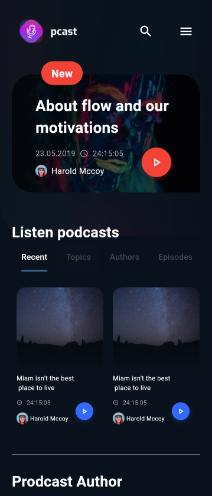
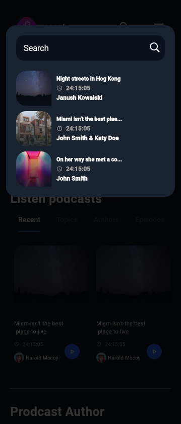
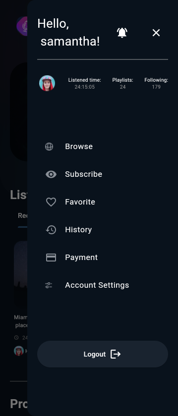
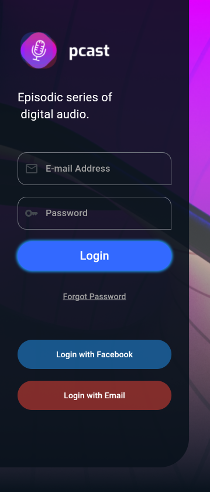

# Songs/Podcast  

A visually appealing and user-friendly design for a Songs/Podcast app built entirely with Flutter. This project focuses on crafting an intuitive and engaging user interface without backend integration.  

## Features  
- **Home Screen**: Explore trending songs and popular podcasts.  
- **Now Playing Screen**: Visually rich player UI with playback controls.  
- **Playlist Screen**: Showcase user-created and curated playlists.  
- **Search Functionality**: Design for song and podcast search with filters.  
- **Dark Mode Support**: Clean UI for light and dark themes.  

## Screenshots  

| Home Screen | Search Playing | Menu Screen |  Auth Screen |  
|-------------|-------------|-----------------| -----------------|  
|  |  |  |  |  

## Tech Stack  
- **Framework**: Flutter  
- **State Management**: Provider / Riverpod (for state interactions in design)  
- **Design Tools**: Material Design and Flutter Widgets  

## How to Run  
1. Clone the repository:  
   ```bash  
   git clone https://github.com/suryadeveloper03/Songs-Podcast.git  
